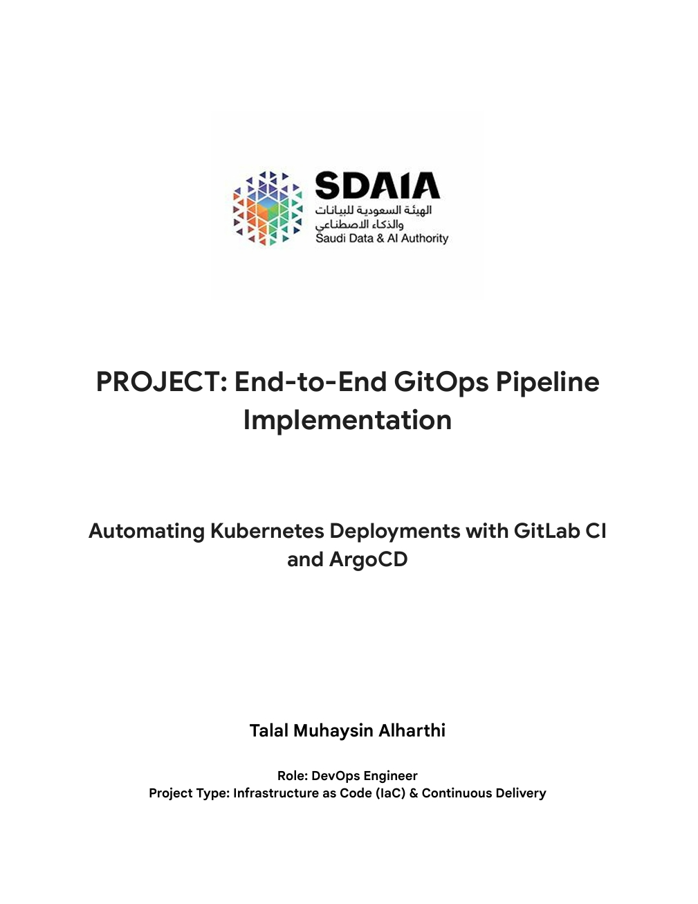

# GitOps Application

A comprehensive GitOps implementation for Kubernetes deployments, enabling automated, declarative infrastructure and application management through Git-based workflows.

## Overview

This project demonstrates modern GitOps practices using industry-standard tools to achieve continuous deployment, infrastructure as code, and automated synchronization between Git repositories and Kubernetes clusters.

## Features

- **Declarative Infrastructure**: All infrastructure and application configurations defined as code
- **Automated Deployments**: Continuous deployment triggered by Git commits
- **Version Control**: Complete audit trail of all changes through Git history
- **Rollback Capability**: Easy rollback to previous states using Git revert
- **Multi-Environment Support**: Manage development, staging, and production environments
- **Security & Compliance**: Built-in security scanning and policy enforcement

## Architecture

The application follows GitOps principles where:
- Git is the single source of truth
- Kubernetes resources are declaratively defined
- Automated agents ensure cluster state matches Git state
- All changes are versioned and auditable

## Prerequisites

- Kubernetes cluster (v1.20+)
- kubectl configured with cluster access
- Git (v2.30+)
- ArgoCD or Flux CD (for GitOps automation)
- Docker (for local development)

## Installation

### Quick Start

1. Clone the repository:
```bash
git clone https://gitlab.com/talal41419/gitops-app.git
cd gitops-app
```

2. Configure your Kubernetes context:
```bash
kubectl config use-context <your-cluster-context>
```

3. Deploy the application:
```bash
kubectl apply -f manifests/
```

### GitOps Setup with ArgoCD

1. Install ArgoCD in your cluster:
```bash
kubectl create namespace argocd
kubectl apply -n argocd -f https://raw.githubusercontent.com/argoproj/argo-cd/stable/manifests/install.yaml
```

2. Create an ArgoCD application pointing to this repository:
```bash
kubectl apply -f argocd/application.yaml
```

## Usage

### Deploying Changes

1. Make changes to your Kubernetes manifests in the `manifests/` directory
2. Commit and push to the repository:
```bash
git add .
git commit -m "Update deployment configuration"
git push origin main
```
3. ArgoCD/Flux will automatically detect and apply changes to your cluster

### Monitoring Deployments

```bash
# Check application status
kubectl get pods -n <namespace>

# View ArgoCD application status
argocd app get gitops-app

# Check deployment logs
kubectl logs -f deployment/<deployment-name> -n <namespace>
```

## Project Structure

```
gitops-app/
├── manifests/          # Kubernetes manifests
│   ├── deployment.yaml
│   ├── service.yaml
│   └── ingress.yaml
├── argocd/            # ArgoCD configuration
├── helm/              # Helm charts (if applicable)
├── docs/              # Documentation
│   ├── cover.png
│   └── gitops-app.pdf
├── scripts/           # Automation scripts
└── README.md
```

### Documentation
Click the image below to read the full PDF:
[](docs/gitops-app.pdf)

## Configuration

### Environment Variables

Key environment variables used in the application:

```yaml
APP_ENV: production
LOG_LEVEL: info
DATABASE_URL: <your-database-url>
```

### Customization

Modify the following files to customize the deployment:

- `manifests/deployment.yaml` - Application deployment configuration
- `manifests/service.yaml` - Service exposure settings
- `manifests/configmap.yaml` - Application configuration

## CI/CD Pipeline

This project includes automated CI/CD pipelines using GitLab CI:

- **Build Stage**: Container image building and testing
- **Test Stage**: Automated testing and security scanning
- **Deploy Stage**: Automatic deployment to Kubernetes clusters

See `.gitlab-ci.yml` for pipeline configuration details.

## Security

- All container images are scanned for vulnerabilities
- RBAC policies enforce least-privilege access
- Secrets are managed using Kubernetes Secrets or external secret managers
- Network policies restrict pod-to-pod communication

## Monitoring & Observability

- **Metrics**: Prometheus for metrics collection
- **Logging**: Centralized logging with ELK/EFK stack
- **Tracing**: Distributed tracing with Jaeger
- **Dashboards**: Grafana dashboards for visualization

## Troubleshooting

### Common Issues

**Issue**: ArgoCD not syncing changes
```bash
# Force sync
argocd app sync gitops-app --force
```

**Issue**: Pod not starting
```bash
# Check pod events
kubectl describe pod <pod-name> -n <namespace>

# View logs
kubectl logs <pod-name> -n <namespace>
```

## Contributing

We welcome contributions! Please follow these steps:

1. Fork the repository
2. Create a feature branch (`git checkout -b feature/amazing-feature`)
3. Commit your changes (`git commit -m 'Add amazing feature'`)
4. Push to the branch (`git push origin feature/amazing-feature`)
5. Open a Merge Request

### Code Standards

- Follow Kubernetes best practices
- Ensure all manifests pass `kubectl apply --dry-run`
- Update documentation for significant changes
- Add tests for new features

## Support

- **Issues**: Report bugs and feature requests via [GitLab Issues](https://gitlab.com/talal41419/gitops-app/issues)
- **Documentation**: Full documentation available in the `docs/` directory
- **Community**: Join our discussions in the project's GitLab page

## Roadmap

- [ ] Add Helm chart support
- [ ] Implement blue-green deployment strategy
- [ ] Add automated backup and restore procedures
- [ ] Integrate with service mesh (Istio/Linkerd)
- [ ] Multi-cluster deployment support
- [ ] Enhanced monitoring dashboards

## Authors & Acknowledgments

- **Project Lead**: Talal
- **Contributors**: See [CONTRIBUTORS.md](CONTRIBUTORS.md)
- Special thanks to the open-source community and GitOps Working Group

## License

This project is licensed under the MIT License - see the [LICENSE](LICENSE) file for details.

## Project Status

🟢 **Active Development** - This project is actively maintained and accepting contributions.

---

**Built with GitOps principles** | **Powered by Kubernetes** | **Automated with CI/CD**

For detailed technical documentation, architecture diagrams, and setup guides, please refer to the PDF documentation linked above.
